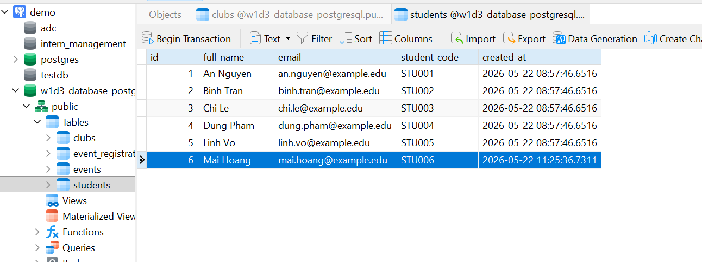
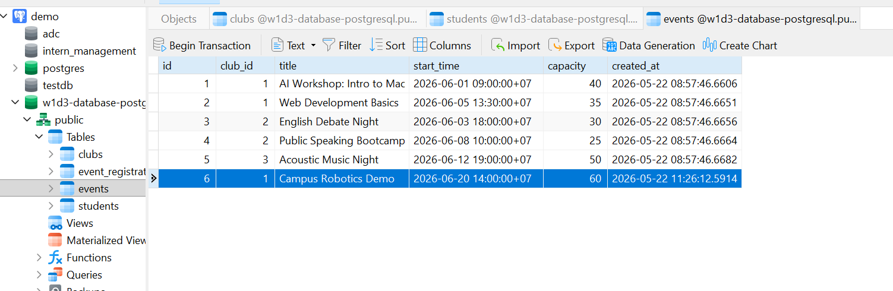
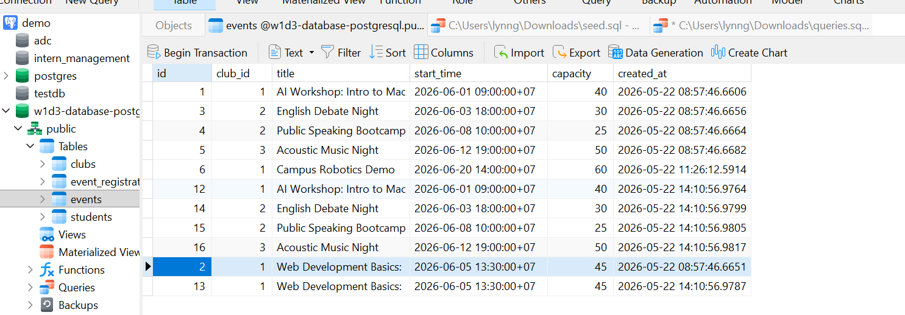
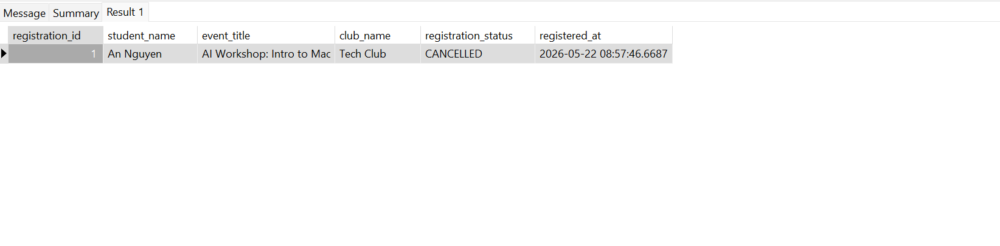
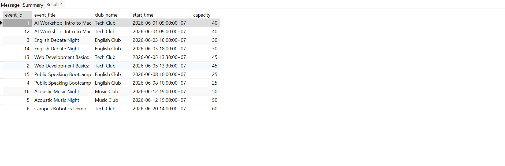
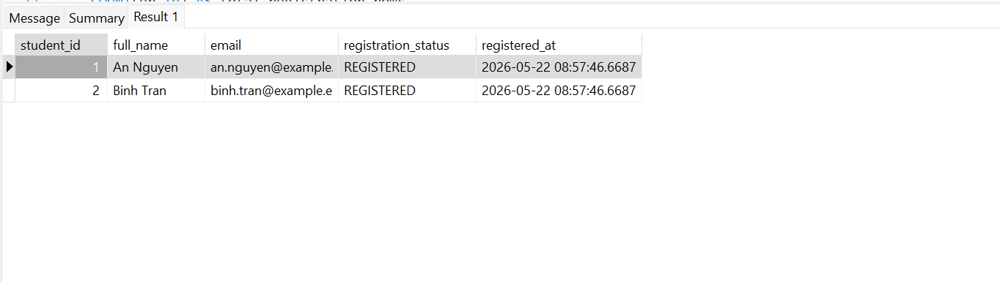
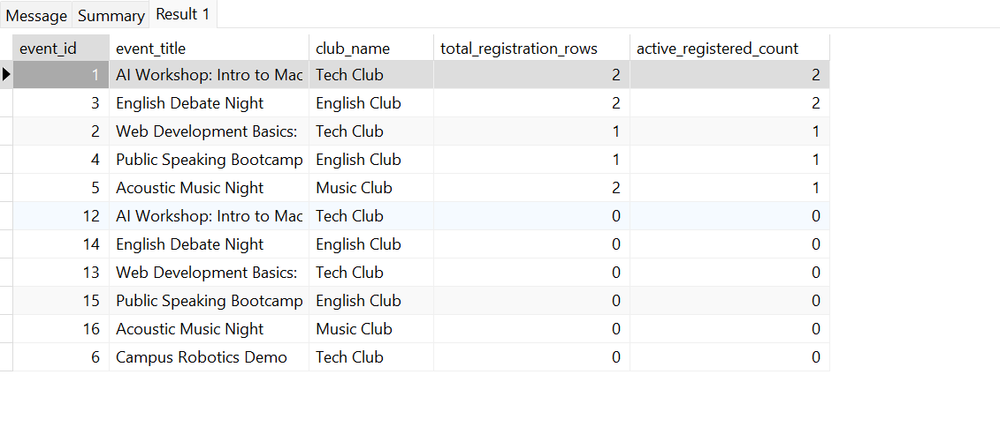

# Query Results Evidence

File chạy: `sql/queries.sql`

Thứ tự chạy trước đó: schema->seed->queries

## Q1: Insert một student mới

Result:

## Q2: Insert một event mới cho một club đã có

Result:

## Q3: Update thông tin một event

Result:

## Q4: Cancel một registration có điều kiện rõ ràng

Result:

## Q5: Select danh sách event kèm tên club

Result:

## Q6: Select danh sách student đã đăng ký một event cụ thể

Result:

## Q7: Count số lượng registration theo từng event

Result:

